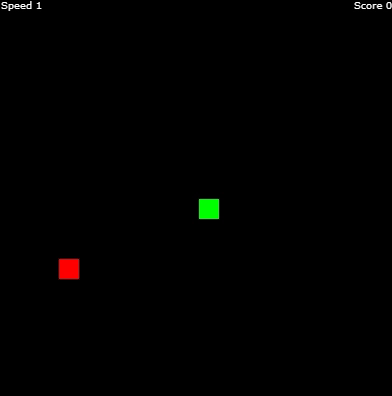

# Jankey Snake
Just a normal version of Snake that might be a little bit ~~Janky~~ Jankey.

Jankey Snake website hosted here --> https://dreamy-phoenix-3a6eef.netlify.app/

## Game Preview

## Objective
The objective of Snake is to get as large as you can. You do this by eating apples, spread along the map. Once you have filled up the entire screen, you essentially win.

## Features
Jankey Snake as of version 1.0.0 has 6 modes, five of which will be available when you first start the game.
These modes are:
- Easy Mode
- Normal Mode
- Hard Mode
- Impossible Mode
- Same Speed Mode
- True Impossible Mode

In the top left corner of the game, there will be a score counter. Every time you eat an apple, your score will increase.

Jankey Snake also includes speed changes. A speed change will happen every time your score hits a multiple of 5. A speed change will add or subtract a certain number from your overall speed, in turn making the game run faster or slower.

## Modes
### Easy Mode:
In easy mode the initial speed will be set to 1 and every time you obtain a speed change '0.5' will be added to the speed.

### Normal Mode:
This is the default mode for Jankey Snake. The initial speed is 1. When you obtain a speed change '1' will be added to your overall speed.

### Hard Mode:
Starting speed will be set to 1 and every time you get a speed change '3' will be added to the speed.

### Impossible Mode:
When you begin impossible mode the initial speed will be set to 10. For your first speed change '10' will be added to the overall speed. Every speed change will be half of the last speed change (first change = 10, second change = 5, ect...). If you manage to get a score of 20 in this mode, something special might happen!

### Same Speed Mode:
Same Speed Mode is for people that liked how the original version of Jankey Snake worked (version 1.0.0). The starting speed will be set to 10 and no speed changes will occur in this mode.

### True Impossible Mode:
If you manage to obtain a score of 20 in Impossible Mode, you will be allowed to play this mode. This is the HARDEST mode in all of Jankey Snake and no-one has ever obtained a score of 30 in this mode. Try if you can!

## Planned Changes / Bug Fixes
- [x] Add different modes.
- [ ] Fix apples spawning inside of player.
- [ ] Add a custom mode.
- [x] Fix snake being able to turn inside of itself.
- [x] Add true impossible mode.
- [ ] Add a settings panel.
- [ ] Add an option to teleport when snake hits border.
- [ ] Add an option to change style and color of snake and apple.
- [ ] Add a way to go back to version 1.0.0 of Jankey Snake.
- [ ] Add option to change speed and speed change amount.
- [ ] Add a way to restart the game without reloading the page or changing modes.
- [ ] Make keys more reactive to feel smoother.
- [ ] Add visual effects and an option to disable/enable them.
- [ ] Add Sound and a volume option.
- [ ] Add option to change the number of apples that spawn.